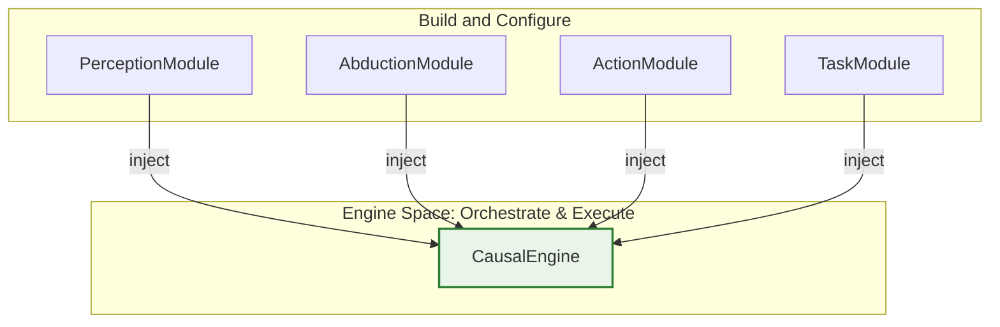

# Causal Engine - A Decoupled, Modular, and Extensible Causal Inference Engine

[](https://opensource.org/licenses/Apache-2.0)

**`causal-engine`** is a PyTorch-based library that provides the core components for building causal machine learning models based on the groundbreaking CausalEngine™ algorithm. It moves beyond traditional correlation-based machine learning by modeling the underlying causal mechanism **Y = f(U, ε)**.

This library is the direct result of a strategic refactoring of the original `causal-sklearn` project, designed from the ground up to be modular, extensible, and mathematically pure.

## 🚀 Core Philosophy

The architecture of `causal-engine` is guided by a few key principles:

-   **🧩 Composition over Inheritance**: The `CausalEngine` is a simple orchestrator that composes independent, user-provided modules.
-   **📦 Task as a Module**: It elegantly encapsulates task-specific logic (like prediction heads and loss functions) into a single, swappable `TaskModule`.
-   **🤝 Contract-Driven Design**: All core components adhere to strict abstract base class (ABC) interfaces, ensuring robustness and extensibility.
-   **🧠 Distribution-Aware**: The engine is designed to handle different probability distributions (like Cauchy and Gaussian) consistently across all components.

## 🏗️ Architecture at a Glance

The `CausalEngine` is assembled by injecting four key modules at initialization:

1.  **`PerceptionModule`**: `X → Z` (Feature Extraction)
2.  **`AbductionModule`**: `Z → U` (Causal Representation Distribution)
3.  **`ActionModule`**: `U → S` (Decision Score Distribution)
4.  **`TaskModule`**: Encapsulates the `Head` (for prediction) and `Loss` (for training).



## 🛠️ Installation

### From Source (Recommended for Developers)

The `causal-engine` is currently available on the `decoupled-engine` branch.

```bash
# 1. Clone the repository
git clone https://github.com/1587causalai/causal-sklearn.git
cd causal-sklearn

# 2. Switch to the new engine's branch
git checkout decoupled-engine

# 3. Install in editable mode
pip install -e .
```

## ⚡ Quick Start

Building and training a model with `causal-engine` is straightforward and fully embraces the PyTorch ecosystem.

```python
import torch
from causal_engine.core.engine import CausalEngine
from causal_engine.defaults.mlp import MLPPerception, MLPAbduction, LinearAction
from causal_engine.tasks.regression import RegressionTask

# 1. Initialize all modules independently
perception_net = MLPPerception(input_size=10, repre_size=20)
abduction_net = MLPAbduction(repre_size=20, causal_size=5)
action_net = LinearAction(causal_size=5, output_size=1, distribution="cauchy")
regression_task = RegressionTask(distribution="cauchy")

# 2. Assemble the engine via dependency injection
engine = CausalEngine(
    perception=perception_net,
    abduction=abduction_net,
    action=action_net,
    task=regression_task
)

# 3. Use a standard PyTorch training loop
optimizer = torch.optim.Adam(engine.parameters(), lr=1e-3)
loss_fn = engine.task.loss  # Get loss function from the task module

# Dummy data
X_train = torch.randn(128, 10)
y_train = torch.randn(128)

# Training step
optimizer.zero_grad()
mu_S, gamma_S = engine(X_train)  # Get decision score distribution
loss = loss_fn(y_train, (mu_S, gamma_S))
loss.backward()
optimizer.step()

print(f"Training loss: {loss.item():.4f}")
```

## 📚 Tutorials

For complete, end-to-end examples of how to use the engine for different tasks, please see the following tutorials:

-   **Regression**: [`examples/tutorial_regression.py`](./examples/tutorial_regression.py)
-   **Classification**: [`examples/tutorial_classification.py`](./examples/tutorial_classification.py)

## 📄 License

This project is licensed under the Apache License 2.0 - see the [LICENSE](LICENSE) file for details.