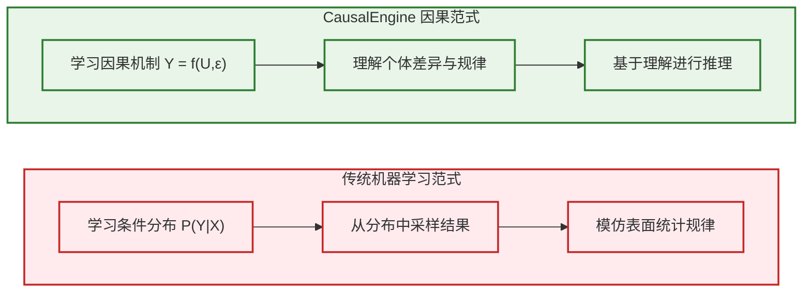
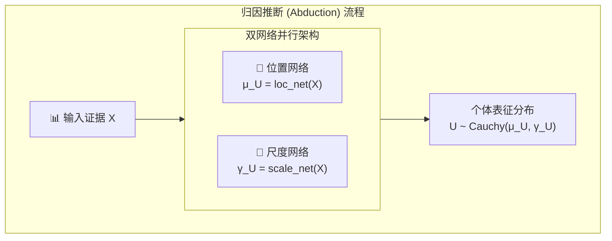
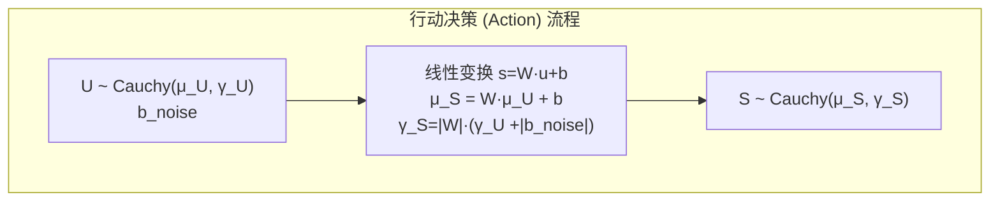
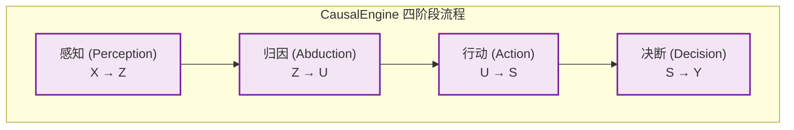

# 《因果引擎》：对机器学习核心认知的系统性重塑 (v2-科学版)

> **作者注**：本文旨在客观、精确地阐述 `CausalEngine` 工作在多个基本层面，如何系统性地重塑了机器学习与因果推断领域的现有认知框架。

---

`CausalEngine` 的理论与算法，在多个基本层面，对机器学习与因果推断的现有认知体系，构成了系统性的重塑。所有这些重塑，均源于其在学习目标上的一个根本性转变。

## 认知重塑（一）：学习目标的重定义：从条件概率分布到因果结构方程

这是所有后续认知重塑的技术前提。

现有主流的机器学习范式，其核心是**学习条件概率分布 `P(Y|X)`**。该范式的目标是构建一个能高精度预测 `Y` 的函数，其成功由预测误差来衡量。

**`CausalEngine` 带来的根本性转变是**：它将学习目标从**学习统计上的关联**，切换为**学习物理上的生成机制**，即因果结构方程：
$$Y = f(U, \epsilon)$$
其中 `U` 代表个体内在的因果属性，`ε` 代表外生的随机噪声。

这个转变重新定义了模型、数据和预测的角色：
*   **模型功能**：从一个旨在**拟合数据分布**的预测模型，转变为一个旨在**推断数据生成过程**的解释模型。
*   **数据角色**：数据不再是需要被拟合的"真实画布"，而被视为底层因果现实投射出的、不完整的"观测证据"。
*   **预测过程**：预测从一个基于历史相关性的"统计推断"，转变为一个基于因果律的"模拟推演"：首先推断`U`，再通过`f`进行演算。

正是这个技术内核的根本性转变，才引发了以下一系列认知上的演进。

## 认知重塑（二）：应用范围的拓展：将因果推断延伸至纯观测数据

既有的因果推断理论，强依赖于"**干预（treatment）**"的存在。因此，其应用场景通常局限于拥有明确`treatment`和`control`组的实验性或准实验性数据集。

**`CausalEngine` 带来的冲击是**：它证明了，即便在缺乏明确"干预"变量的纯观测数据中，因果分析依然是可能的。它通过对潜在变量`U`的建模，为因果分析提供了一个新的切入点。其核心在于"归因（Abduction）"阶段，模型通过双网络架构，从观测证据 `X` 中，推断出代表个体`U`的分布参数：

- **位置（中心）**：$\mu_U = \text{loc\_net}(X)$
- **尺度（不确定性）**：$\gamma_U = \text{scale\_net}(X)$

最终得到个体的因果表征分布：
$$U \sim \text{Cauchy}(\mu_U, \gamma_U)$$

这个过程的详细流程如下：

这表明，因果探索的关键，不完全在于数据采集过程中是否存在**外部干预**，更在于模型是否具备**发现和建模内部因果驱动力**的能力。`CausalEngine` 的存在，将因果分析的应用潜力，从特定的实验数据集，拓展到了更广泛的通用观测数据集。

## 认知重塑（三）：回归分析的再聚焦：从预测精度到机制识别

传统回归分析的核心目标，是**找到一个能最小化预测误差的函数 `f`**。整个领域的方法论，都围绕着提升拟合优度（Goodness-of-Fit）展开，而残差（residual）则被视为需要被最小化的负面指标。

**`CausalEngine` 带来的冲击是**：它为回归分析提供了一个双重目标。除了追求**预测精度（prediction accuracy）**，回归分析还可以追求**机制识别（mechanism identification）**。

它将回归的目标从 `E[Y|X]` 这个群体层面的统计量，演进为 `Y = f(U, ε)` 这组个体层面的因果机制。在这个框架下，残差不再是单一的误差项，而被**解剖（decomposed）**为代表个体因果信息的 `U` 和代表纯粹随机性的 `ε`。

这一转变，使得回归分析在作为"预测工具"的同时，也具备了成为"**因果探索工具**"的潜力。

## 认知重塑（四）：不确定性的再认识：从单一量化到双源分解

对于不确定性，传统方法通常是将其量化为一个单一的指标（例如方差），用以反映模型整体的置信度。

**`CausalEngine` 带来的冲击是**：它清晰地揭示了**不确定性的二元结构（Dual Sources of Uncertainty）**。它以数学上可分离的方式，将任何一次预测的总不确定性，分解为两个来源：

1.  **内生不确定性 (Endogenous)**: 源于**认知局限**，即模型对个体`U`的内在属性掌握不充分所导致的不确定性。这由模型推断出的尺度参数 `γ_U` 来量化。
2.  **外生不确定性 (Exogenous)**: 源于**系统内在的随机性**，即外部环境的随机冲击所导致的不确定性。这由一个可配置的噪声参数 `b_noise` 来建模。

这两个不确定性来源，最终在"行动（Action）"阶段，通过一次线形因果变换，共同决定了决策得分 `S` 的分布。其数学全貌如下：

- **决策得分中心**: $\mu_S = W_A \cdot \mu_U + b_A$
- **决策得分尺度**: $\gamma_S = |W_A| \cdot (\gamma_U + |b_{noise}|)$

其流程可以被精确地可视化为：

这种分解，使得不确定性从一个模糊的"数值"，变成了一个包含着明确诊断信息的"向量"。它让模型能够区分"我不知道"和"世界本就如此"。

## 认知重塑（五）：可解释性的新路径：从"事后归因"到"设计使然"

目前主流的"可解释AI"（XAI）方法，大多是在一个已训练好的模型**外部**，采用事后归因（post-hoc attribution）技术（如LIME, SHAP）来近似解释模型的预测行为。

**`CausalEngine` 带来的冲击是**：它提供了一种"**设计使然的可解释性"（Interpretability by Design）**。

它的四阶段架构（感知→归因→行动→决断）并非一个任意的计算流程，其结构本身就旨在**模拟一个透明的、符合人类直觉的因果推理过程**。

因此，对模型的理解，不再依赖于外部的、近似的"翻译"工具，而是可以通过直接"**读取**"模型在各个阶段的内部状态（如推断出的`U`的分布）来实现。

这为可解释性研究，提供了一个从"为黑箱作注"到"打造白箱"的新探索方向。 