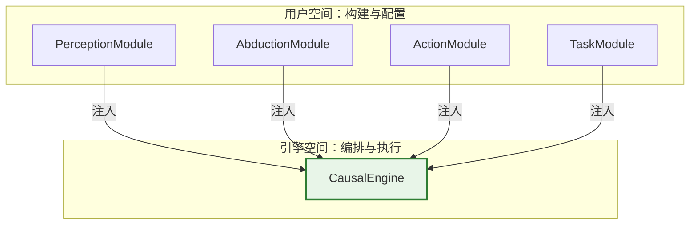

# 解耦因果引擎架构设计文档 (v3.0 - Final)

本文档是新分支开发的最终“宪法”，定义了一个高度模块化、数学纯粹且工程稳健的因果引擎架构。其核心思想是通过**依赖注入**实现模块解耦，通过**“任务即模块”**模式封装语义耦合，并通过**策略模式**解决横切关注点。

---

## 1. 核心架构：四大可注入模块

`CausalEngine` 是一个纯粹的**编排器 (Orchestrator)**，通过构造函数接收四个预先初始化好的核心模块。

-   `PerceptionModule`: `X → Z`
-   `AbductionModule`: `Z → U`
-   `ActionModule`: `U → S`
-   `TaskModule`: 封装 `Head` 与 `Loss`



---

## 2. 模块接口标准化 (ABCs)

所有核心模块都将定义为**抽象基类 (ABC)**，以强制执行接口约定。

### 2.1 `PerceptionModule` & `AbductionModule`
-   **`PerceptionModule.forward(x)`**: `-> z` (Tensor)
-   **`AbductionModule.forward(z)`**: `-> (μ_U, γ_U)` (Tuple[Tensor, Tensor])

### 2.2 `ActionModule`
-   **职责**: `U → S`，并管理五种推理模式的计算逻辑。
-   **接口**: `forward(mu_U, gamma_U, mode)`: `-> (μ_S, γ_S)` (Tuple[Tensor, Tensor])
    -   **关键**: 为了接口统一，即使在 `deterministic` 模式下，也必须返回一个 `(μ_S, torch.zeros_like(μ_S))` 的元组。

### 2.3 `TaskModule` (核心)
-   **职责**: 封装与特定任务相关的所有逻辑，是**语义耦合**的最终归宿。
-   **接口**:
    -   `head() -> nn.Module`: 返回用于**预测**的决策头。
        -   `Head.forward(decision_scores)`: `-> y_pred`
    -   `loss() -> nn.Module`: 返回用于**训练**的损失函数。
        -   `Loss.forward(y_true, decision_scores)`: `-> loss`

---

## 3. 核心设计模式

### 3.1 “任务即模块”
此模式通过聚合 `Head` 和 `Loss` 来简化用户接口并封装业务逻辑。

**示例**: `RegressionTask`
```python
# 伪代码
class RegressionTask(TaskModule):
    def __init__(self, distribution: str = 'cauchy'):
        self._head = RegressionHead()
        self._loss = SmartRegressionLoss(distribution=distribution)
    # ... 实现 head 和 loss 的 property ...
```
-   **用户体验**: `my_task = RegressionTask(distribution="cauchy")`

### 3.2 损失计算的“策略模式”
这是解决“推理模式”这一**横切关注点**的关键。`Loss` 模块将不再依赖外部的 `mode` 参数，而是根据输入数据的特征自动选择计算策略。

**示例**: `SmartRegressionLoss`
```python
# 伪代码
class SmartRegressionLoss(nn.Module):
    def __init__(self, distribution: str = 'cauchy'):
        super().__init__()
        # 策略1: 概率模式下的损失
        self.probabilistic_loss = NLLLoss(distribution=distribution)
        # 策略2: 确定性模式下的损失
        self.deterministic_loss = nn.MSELoss()

    def forward(self, y_true, decision_scores):
        mu_S, gamma_S = decision_scores

        # 自动分发：根据 gamma_S 是否为零选择策略
        if torch.all(gamma_S == 0):
            return self.deterministic_loss(mu_S, y_true)
        else:
            return self.probabilistic_loss(y_true, mu_S, gamma_S)

# NLLLoss 的实现
class NLLLoss(nn.Module):
    def __init__(self, distribution: str = 'cauchy'):
        # ... 根据 distribution 选择 cauchy_nll 或 gaussian_nll ...
```
-   **优势**: 彻底解耦了 `mode` 与损失计算的依赖，逻辑内聚，接口纯粹。

---

## 4. `CausalEngine` 接口与工作流

`CausalEngine` 的实现将极为简洁，只做最核心的编排工作。

```python
# CausalEngine 伪代码
class CausalEngine(nn.Module):
    def __init__(self, perception: PerceptionModule, abduction: AbductionModule, action: ActionModule, task: TaskModule):
        # ... 注入模块 ...
        self.perception = perception
        self.abduction = abduction
        self.action = action
        self.task = task

    def forward(self, x: torch.Tensor, mode: str = 'standard') -> Tuple[torch.Tensor, torch.Tensor]:
        z = self.perception(x)
        mu_U, gamma_U = self.abduction(z)
        mu_S, gamma_S = self.action(mu_U, gamma_U, mode=mode)
        return mu_S, gamma_S

    def predict(self, x: torch.Tensor, mode: str = 'standard') -> torch.Tensor:
        decision_scores = self.forward(x, mode=mode)
        return self.task.head(decision_scores)
```

### 4.1 训练流程
训练循环由用户完全掌控，`CausalEngine` 只负责生成 `S` 分布。

```python
# 伪代码
engine = CausalEngine(...)
optimizer = torch.optim.Adam(engine.parameters())
loss_fn = engine.task.loss # 从task中获取智能损失函数

for x, y_true in dataloader:
    optimizer.zero_grad()
    # 无论何种模式，引擎都只负责到 S 分布
    mu_S, gamma_S = engine(x, mode='deterministic') # 或 'standard'
    # loss_fn 内部会自动处理 deterministic 情况
    loss = loss_fn(y_true, (mu_S, gamma_S))
    loss.backward()
    optimizer.step()
```

### 4.2 推理流程
推理时，用户可以灵活切换模式来获得不同的预测结果。

```python
# 伪代码
# 获取点估计预测
y_pred = engine.predict(x_test, mode='deterministic')
# 获取完整分布用于分析
mu_S, gamma_S = engine(x_test, mode='standard')
```

---

## 5. 总结：最终设计原则

1.  **组合与依赖注入**: 引擎是模块的容器，实现了高层解耦。
2.  **任务即模块**: 封装了 `Head` 和 `Loss` 的语义耦合，简化了用户接口。
3.  **策略模式解耦横切关注点**: `Loss` 模块通过检查输入数据自适应计算，移除了对外部 `mode` 状态的依赖。
4.  **接口契约化**: 通过ABC强制接口，保证了系统在扩展时的稳健性。
5.  **训练/推理完全分离**: 引擎是纯粹的 `nn.Module`，拥抱整个PyTorch生态。
6.  **数学纯粹性**: 架构清晰地反映了 `X → S_dist` 的核心数学流程，以及后续预测与评估的分离。