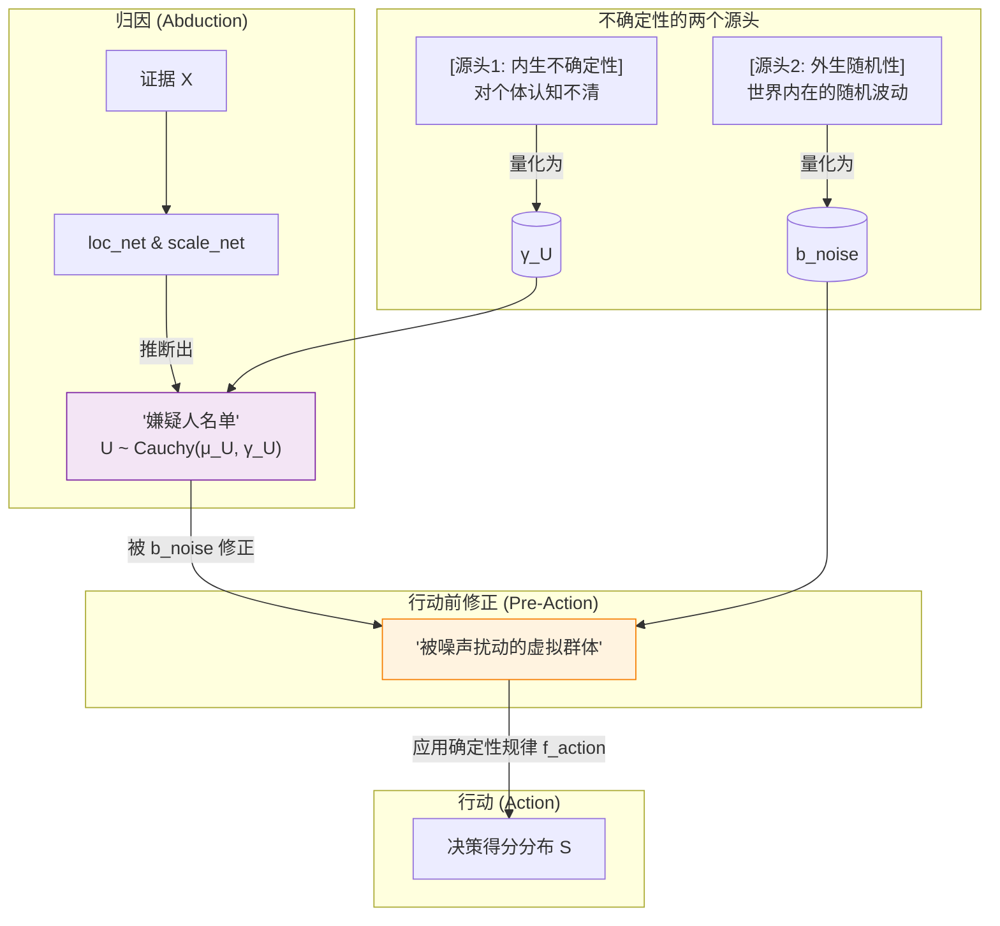

# 关于“噪声”的思辨：我为论文确立的核心叙事与科学定位

> **目的**: 我希望通过这篇备忘录，深入并固化我对我们论文核心主张的思考。它将作为写作过程中的“北极星”，确保所有章节的论述，都统一在我所确立的这个严谨、自信且极具说服力的核心论点之下。

---

## 1. 缘起：一个极具诱惑力，却又无比危险的标题

我一直在思考，如何才能最好地讲述我们 `Causal Regression` 的故事。一个标题曾一度在我脑海中挥之不去：

~~`Causal Regression: When Statistical Noise Becomes Causal Signal`~~

它听起来简洁、有力，富有戏剧性。但随着我思考的深入，我愈发觉得这个说法不仅在科学上不精确，甚至在哲学上是错误的。它是一个“美丽的陷阱”。

这篇备忘录，就是为了彻底澄清我的思考：我们工作的真正贡献，绝不是将“噪声”转化为“信号”。

## 2. 思辨：为何“噪声变信号”是一个必须被拒绝的叙事？

我之所以认为这个说法存在致命缺陷，源于两个层面的担忧：技术上的不精确，和哲学上的过度声明。

### 2.1 技术上的不精确：对“噪声”本质的误读

在传统回归 `Y = g(X) + noise` 的框架下，`noise` 项更像是一个未经分类的“垃圾袋”，里面至少混杂了三种性质完全不同的东西：
1.  **结构化的个体信息 (`U`)**: 这部分是可解释的、源于个体差异的因果因素。**这是我们想要提炼的黄金**。
2.  **真正的随机性 (`ε`)**: 源于世界内在的、不可约的随机波动。**这是我们必须承认的现实**。
3.  **模型设定误差**: 因我们选择的 `g(X)` 函数形式不完美而产生的偏差。

“噪声变信号”的说法，错误地暗示了我们施展了某种炼金术，将整个“垃圾袋”都变成了“黄金”。但我的 `CausalEngine` 做的远比这精妙：它更像一个精密的离心机，其伟大之处在于，**它能有原则地 (principledly) 将 `U` 从这个混合物中分离出来，同时诚实地承认并保留 `ε` 的存在。**

所以，我的主张不是“转化”，而是“分解”。

### 2.2 哲学上的过度声明：对“决定论”的危险暗示

我更深层次的担忧是，这个说法潜藏着一个危险的、完全决定论的哲学立场，即“一切皆有因，所谓的随机只是暂时的无知”。如果采纳这种叙事，我们将面临审稿人最尖锐且无法回避的攻击：
- “你们真的认为物理或社会系统中不存在内在的随机性吗？”
- “你们是否在宣称可以解释所有方差，从而推翻了统计学的一些基本限制？”

这是一个我们无法、也不应该陷入的泥潭。

## 3. 我的核心主张：分解随机性，而非消灭它

我们工作的真正核心，不是进行炼金术，而是对回归分析的范式本身进行一次重塑。我们正从学习群体的条件期望 `E[Y|X]`，迈向学习个体的因果机制 `Y = f(U, ε)`。

为了真正实现这一点，我必须精确地区分随机性的两个完全不同的来源，它们在我的 `CausalEngine` 框架中，有着截然不同的哲学根源、数学符号和处理逻辑。

### 随机性的双源分解 (Dual Sources of Randomness)

我将系统中的不确定性，严格分解为两个正交的来源：

1.  **内生不确定性 (Endogenous Uncertainty)**：源于我们对个体认知的局限。
2.  **外生随机性 (Exogenous Randomness)**：源于世界内在的、不可约的随机波动。

下面是我对这两者在概念、数学和逻辑上的清晰界定：

| 对比维度 | 1. 内生不确定性 (Endogenous Uncertainty) | 2. 外生随机性 (Exogenous Randomness) |
| :--- | :--- | :--- |
| **核心概念** | **我们是谁？(Who are we?)** | **世界发生了什么？(What happens to us?)** |
| **哲学根源** | **认知论 (Epistemology)**：源于我们知识的不足。我们无法通过有限的证据 `X` 锁定唯一的个体 `u`，只能得到一个“嫌疑人名单” `P(U\|X)`。 | **本体论 (Ontology)**：源于世界本身的内在随机性。即使个体 `u` 确定，结果仍可能受随机因素 `ε` 影响。 |
| **数学符号** | `γ_U` (Gamma_U) | `b_noise` (bias_noise) |
| **符号含义** | `Abduction`网络推断出的柯西分布的**尺度参数**。它量化了“嫌疑人名单”的宽度。`γ_U` 越大，我们对个体的认知越模糊。 | 一个可配置的、代表外部世界随机性**强度**的标量。 |
| **作用逻辑** | 由 `scale_net(X)` **推断**得出，是模型学习的一部分，定义了 `U` 的先验。 | 通过**数学等价假设**，将 `ε` 的影响转化为对 `U` 分布的**修正**，构造出“被噪声扰动的虚拟个体群体”。 |
| **最终公式** | \multicolumn{2}{c}{`standard` 模式下决策得分S的尺度：`γ_S = |W_A| * (γ_U + |b_noise|)`} |

这个双源分解的设计，是我整个理论的基石。它清晰地区分了“不知道你是谁”和“不知道你会遇到什么事”，保证了因果规律 `f_action` 本身的纯粹性，并最终实现了模型的高度可解释性与可控性。

## 4. 最终战略

### 1. 叙事钩子：从“表面悖论”到“深层统一”

我们论文最强有力的叙事钩子，源于“因果”（Causality）与“回归”（Regression）这两个学科之间**历史性的、概念性的巨大冲突**。我们的故事不仅仅是关于一个新算法，而是关于如何弥合统计学两大重要领域之间长期存在的鸿沟。

我们将这样把这条叙事线贯穿于整篇论文：

**核心冲突 (The Hook):**

在开篇，我们会将“因果回归”（Causal Regression）作为一个**明显的矛盾修辞法**来呈现。我们将精准地框定出这个历史性的张力：
*   **因果学派 (The "Why" School / Pearl):** 关注干预（intervention）和反事实（counterfactuals）。它问的是**“如果……会怎样？”(what if?)**，并常常鄙视回归模型，认为其只能捕捉相关性。
*   **回归学派 (The "What" School / ML):** 关注预测（prediction）和关联（association）。它问的是**“是什么？”(what is?)**，并常常认为因果模型过于理论化，在实际预测任务中不实用。

这会立刻在读者（尤其是审稿人）的脑海中制造一种认知失调：“你怎么可能将两个基本问题和哲学思想都看似对立的领域统一起来？”

**深层故事 (The Resolution):**

我们方法的精妙之处——也是我们故事的核心——在于，我们并非简单地将两个概念用胶水粘在一起。我们揭示出，它们表面的冲突源于一个**共同的、根本性的局限**：传统模型都将残差（`noise`）视为一个需要被最小化的、无意义的整体。

我们的叙事将展示，统一它们的关键，在于**对噪声进行有原则的分解 (decomposing this noise)**。

**六幕叙事弧 (The Narrative Arc):**

这个故事可以被构建为清晰的六个幕，它将引导从摘要（Abstract）到结论（Conclusion）的整篇论文的行文逻辑：

| 幕 | 阶段 | 叙事要点 |
| :-- | :--- | :--- |
| **I** | **矛盾的术语** | 引入“因果回归”及其背后的历史冲突，提出核心问题：我们如何调和这对矛盾？ |
| **II**| **有缺陷的前提** | 揭示冲突的根源：传统回归将误差视为无意义的“噪声”，一个需要被压制的麻烦。 |
| **III**| **范式转移**| 提出我们的核心论点：回归的目标不应是学习 `E[Y\|X]`，而是建模个体因果机制 `Y = f(U, ε)`。 |
| **IV**| **有原则的分解** | 阐明我们的关键创新：我们不“消灭”噪声，我们**分解**它。我们将结构化的因果信息 (`U`) 从不可约的随机性 (`ε`) 中分离出来。 |
| **V** | **实证检验** | 展示实验结果，证明通过建模 `U`，我们获得了卓越的鲁棒性和可解释性，从而证实了新范式的巨大实用价值。 |
| **VI**| **新的视野** | 总结：通过分解噪声，我们建立了第一个将回归的预测能力与因果的解释能力统一起来的原则性框架。 |

这条叙事线是强有力的，因为它重新定义了问题，尊重了历史背景，并提供了一个能让智识上得到极大满足的解决方案。

---

### 2. 论文标题：我们叙事的完美旗帜

有了这样清晰的叙事策略，论文的标题就必须是其完美的浓缩。它必须是一面既能引人深思又足够精确的旗帜。基于我们的全部讨论，最终的选择已经变得无比清晰。

**最终的、最佳的标题：**

> **`Causal Regression: Learning Interpretable Mechanisms for Robust Prediction`**
> **因果回归：为鲁棒预测学习可解释的机制**

**为什么这个标题是完美的？**

让我们来解构这个标题，看它为何是我们刚刚确立的叙事策略的最佳载体：

1.  **`Causal Regression:`**
    *   **这是品牌，是核心术语。** 它本身就是悖论，是那个能立刻激发读者好奇心、引出我们全部历史冲突的“钩子”。这一点，不容妥协。

2.  **`Learning Interpretable Mechanisms:`**
    *   **这是对我们解决方案在科学上最精确、最可防御的描述。** 它直接回应了那个“美丽但有缺陷”的“噪声变信号”的说法。
    *   “Mechanisms”（机制）直接指向了我们向 `Y = f(U, ε)` 的范式转移。
    *   “Interpretable”（可解释）承诺了理解“为什么”的终极目标——这是建模 `U` 所带来的直接回报。
    *   “Learning”（学习）准确地将我们的工作定位为一种数据驱动的机器学习方法，而非纯理论构建。

3.  **`for Robust Prediction:`**
    *   **这是我们的价值主张，是最终的回报。** 它为更广泛的机器学习社区回答了“所以呢？”（So what?）这个问题。
    *   “Robust Prediction”（鲁棒预测）是一个极具吸引力的价值点。它证明了我们的因果方法论不只是一场哲学思辨，它能在一个所有人都关心的指标上带来卓越的性能。它证明了因果与预测并非冲突，而是相互增强。

这个标题之所以成功，因为它微缩地讲述了我们的整个故事：它提出了一个**悖论**（`Causal Regression`），描述了那个优雅的**解决方案**（`Learning Interpretable Mechanisms`），并承诺了那个强有力的**最终成果**（`for Robust Prediction`）。

它**志存高远、描述精确、且立论可御**——这正是一篇顶级学术论文标题所需要具备的“三位一体”的特质。