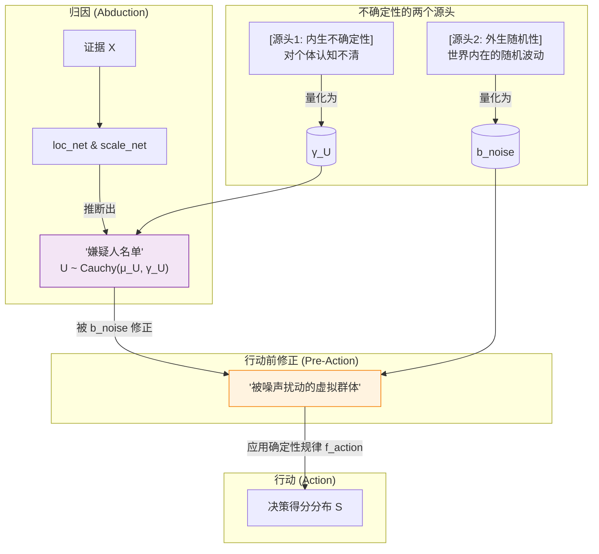

# 关于“噪声”的思辨：我为论文确立的核心叙事与科学定位

> **目的**: 我希望通过这篇备忘录，深入并固化我对我们论文核心主张的思考。它将作为写作过程中的“北极星”，确保所有章节的论述，都统一在我所确立的这个严谨、自信且极具说服力的核心论点之下。

---

## 1. 缘起：一个极具诱惑力，却又无比危险的标题

我一直在思考，如何才能最好地讲述我们 `Causal Regression` 的故事。一个标题曾一度在我脑海中挥之不去：

~~`Causal Regression: When Statistical Noise Becomes Causal Signal`~~

它听起来简洁、有力，富有戏剧性。但随着我思考的深入，我愈发觉得这个说法不仅在科学上不精确，甚至在哲学上是错误的。它是一个“美丽的陷阱”。

这篇备忘录，就是为了彻底澄清我的思考：我们工作的真正贡献，绝不是将“噪声”转化为“信号”。

## 2. 思辨：为何“噪声变信号”是一个必须被拒绝的叙事？

我之所以认为这个说法存在致命缺陷，源于两个层面的担忧：技术上的不精确，和哲学上的过度声明。

### 2.1 技术上的不精确：对“噪声”本质的误读

在传统回归 `Y = g(X) + noise` 的框架下，`noise` 项更像是一个未经分类的“垃圾袋”，里面至少混杂了三种性质完全不同的东西：
1.  **结构化的个体信息 (`U`)**: 这部分是可解释的、源于个体差异的因果因素。**这是我们想要提炼的黄金**。
2.  **真正的随机性 (`ε`)**: 源于世界内在的、不可约的随机波动。**这是我们必须承认的现实**。
3.  **模型设定误差**: 因我们选择的 `g(X)` 函数形式不完美而产生的偏差。

“噪声变信号”的说法，错误地暗示了我们施展了某种炼金术，将整个“垃圾袋”都变成了“黄金”。但我的 `CausalEngine` 做的远比这精妙：它更像一个精密的离心机，其伟大之处在于，**它能有原则地 (principledly) 将 `U` 从这个混合物中分离出来，同时诚实地承认并保留 `ε` 的存在。**

所以，我的主张不是“转化”，而是“分解”。

### 2.2 哲学上的过度声明：对“决定论”的危险暗示

我更深层次的担忧是，这个说法潜藏着一个危险的、完全决定论的哲学立场，即“一切皆有因，所谓的随机只是暂时的无知”。如果采纳这种叙事，我们将面临审稿人最尖锐且无法回避的攻击：
- “你们真的认为物理或社会系统中不存在内在的随机性吗？”
- “你们是否在宣称可以解释所有方差，从而推翻了统计学的一些基本限制？”

这是一个我们无法、也不应该陷入的泥潭。

## 3. 我的核心主张：分解随机性，而非消灭它

我们工作的真正核心，不是进行炼金术，而是对回归分析的范式本身进行一次重塑。我们正从学习群体的条件期望 `E[Y|X]`，迈向学习个体的因果机制 `Y = f(U, ε)`。

为了真正实现这一点，我必须精确地区分随机性的两个完全不同的来源，它们在我的 `CausalEngine` 框架中，有着截然不同的哲学根源、数学符号和处理逻辑。

### 随机性的双源分解 (Dual Sources of Randomness)

我将系统中的不确定性，严格分解为两个正交的来源：

1.  **内生不确定性 (Endogenous Uncertainty)**：源于我们对个体认知的局限。
2.  **外生随机性 (Exogenous Randomness)**：源于世界内在的、不可约的随机波动。

下面是我对这两者在概念、数学和逻辑上的清晰界定：

| 对比维度 | 1. 内生不确定性 (Endogenous Uncertainty) | 2. 外生随机性 (Exogenous Randomness) |
| :--- | :--- | :--- |
| **核心概念** | **我们是谁？(Who are we?)** | **世界发生了什么？(What happens to us?)** |
| **哲学根源** | **认知论 (Epistemology)**：源于我们知识的不足。我们无法通过有限的证据 `X` 锁定唯一的个体 `u`，只能得到一个“嫌疑人名单” `P(U\|X)`。 | **本体论 (Ontology)**：源于世界本身的内在随机性。即使个体 `u` 确定，结果仍可能受随机因素 `ε` 影响。 |
| **数学符号** | `γ_U` (Gamma_U) | `b_noise` (bias_noise) |
| **符号含义** | `Abduction`网络推断出的柯西分布的**尺度参数**。它量化了“嫌疑人名单”的宽度。`γ_U` 越大，我们对个体的认知越模糊。 | 一个可配置的、代表外部世界随机性**强度**的标量。 |
| **作用逻辑** | 由 `scale_net(X)` **推断**得出，是模型学习的一部分，定义了 `U` 的先验。 | 通过**数学等价假设**，将 `ε` 的影响转化为对 `U` 分布的**修正**，构造出“被噪声扰动的虚拟个体群体”。 |
| **最终公式** | \multicolumn{2}{c}{`standard` 模式下决策得分S的尺度：`γ_S = |W_A| * (γ_U + |b_noise|)`} |

这个双源分解的设计，是我整个理论的基石。它清晰地区分了“不知道你是谁”和“不知道你会遇到什么事”，保证了因果规律 `f_action` 本身的纯粹性，并最终实现了模型的高度可解释性与可控性。

## 4. 最终战略

### 4.1 叙事钩子：以最直接的冲突为刃

我同意，一个好的引子应该像一把锐利的匕首，直刺要害。我们无需从宏大的哲学层面开篇，而应聚焦于两个领域最核心、最日常的术语冲突，以此作为我们叙事的锋刃。

**核心冲突 (The Hook):**

我们论文的开篇，将以一个所有从业者都无法回避的、最直接的术语冲突作为钩子：
*   **因果推断**（Causal Inference）的世界里，核心概念是**干预**（Treatment）与结果（Outcome）。它的目标是回答一个**行动**（Action）所产生的**效果**。
*   **回归分析**（Regression Analysis）的世界里，核心概念是**特征**（Features）与目标（Target）。它的目标是完成一个对**值**（Value）的**预测**。

这两个术语体系泾渭分明，分属两个世界。因此，当“因果回归”（Causal Regression）这个词出现时，它必然会引发一个直接的困惑：**我们如何将一个关于“行动”的概念，和一个关于“特征”的概念，融合在一起？** 这就是我们为读者设下的、最简洁也最深刻的悬念。

**深层故事 (The Resolution):**

这个看似简单的术语冲突，引出了一个更根本的问题：传统的回归模型，满足于将`Features`视为一组无差别的、用于预测的“变量”。它从未试图去区分：哪些`Features`仅仅是“相关指标”，而哪些`Features`背后，隐藏着真正的**“因果驱动力”**？

我们的叙事将展示，统一它们的关键，在于**对噪声进行有原则的分解 (decomposing this noise)**，从而从`Features`提供的信息中，去发现和建模那些不可观测的、真正的因果变量`U`。这样，我们就用“回归”的工具，达成了“因果”的目标。

**六幕叙事弧 (The Narrative Arc):**

这个更锐利的钩子，将完美地引出我们后续的六幕式叙事结构。它将作为第一幕，而后续的章节将遵循我们已设计的路线图，从“有缺陷的前提”一直讲到“新的视野”。

| 幕 | 阶段 | 叙事要点 |
| :-- | :--- | :--- |
| **I** | **矛盾的术语** | 引入“因果回归”以及“干预 vs 特征”的核心冲突。 |
| **II**| **有缺陷的前提** | 揭示冲突的根源：传统回归将误差视为无意义的“噪声”，一个需要被压制的麻烦。 |
| **III**| **范式转移**| 提出我们的核心论点：回归的目标不应是学习 `E[Y\|X]`，而是建模个体因果机制 `Y = f(U, ε)`。 |
| **IV**| **有原则的分解** | 阐明我们的关键创新：我们不“消灭”噪声，我们**分解**它。我们将结构化的因果信息 (`U`) 从不可约的随机性 (`ε`) 中分离出来。 |
| **V** | **实证检验** | 展示实验结果，证明通过建模 `U`，我们获得了卓越的鲁棒性和可解释性，从而证实了新范式的巨大实用价值。 |
| **VI**| **新的视野** | 总结：通过分解噪声，我们建立了第一个将回归的预测能力与因果的解释能力统一起来的原则性框架。 |

### 4.2 论文标题：我们叙事的完美旗帜

有了这样清晰的叙事策略，论文的标题就必须是其完美的浓缩。它必须是一面既能引人深思又足够精确的旗帜。在反复推敲和思辨后，我最终确定了那个最能代表我们工作的标题。

**最终的、最佳的标题：**

> **`Causal Regression: Learning Causal Mechanisms for Robust and Interpretable Prediction`**
> **因果回归：为鲁棒与可解释的预测学习因果机制**

**为什么这个标题是完美的？**

这个最终版本，通过两个看似微小却至关重要的调整，实现了立意的飞跃。让我们来解构它，看它为何是我们叙事策略的最佳载体：

1.  **`Causal Regression:`**
    *   **这是品牌，是核心术语。** 它本身就是悖论，是那个能立刻激发读者好奇心、引出我们全部历史冲突的“钩子”。这一点，不容妥协。

2.  **`Learning Causal Mechanisms:`**
    *   **这是从描述“质量”到宣告“本质”的飞跃。** 相较于“可解释的机制”（Interpretable Mechanisms），“因果机制”（Causal Mechanisms）的主张要强大得多。它不再满足于说我们学到的机制恰好是可解释的，而是更进一步、更自信地宣告：**我们学习的，就是因果机制本身。** 这使得我们论文的核心贡献更加鲜明和有力。

3.  **`for Robust and Interpretable Prediction:`**
    *   **这是从单一价值到双重价值的升维。** 这个调整将“可解释性”从过程的属性，提升到了**结果的价值**。它明确指出，我们的贡献是双重的、同等重要的：我们不仅提供了一个**性能更优越**（Robust）的预测，还提供了一个**能够被深刻理解**（Interpretable）的预测。这就构建了一个更完整、更难以抗拒的价值闭环，完美地回应了当前AI领域对性能和可信度的双重诉求。

这个最终的标题微缩地讲述了我们的整个故事：它提出了一个**悖论**（`Causal Regression`），描述了那个优雅而深刻的**解决方案**（`Learning Causal Mechanisms`），并承诺了那个强有力的**双重最终成果**（`for Robust and Interpretable Prediction`）。

它**志存高远、描述精确、且立论可御**——这正是一篇顶级学术论文标题所需要具备的“三位一体”的特质。